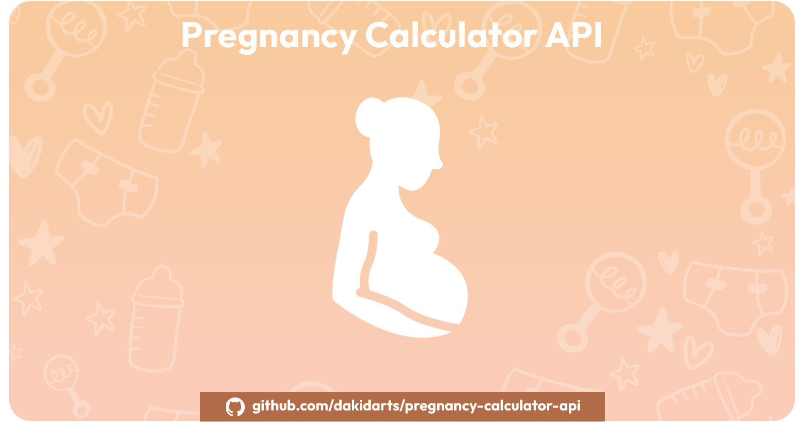

# Pregnancy Calculator API



## ✨ Overview

Welcome to the Pregnancy Calculator API! This API provides endpoints for calculating various aspects related to pregnancy, including the Fertility Window, Pregnancy Due Date, Pregnancy Week, and Pregnancy Weight Recommendation. With this API, you can easily integrate these calculations into your applications, websites, or any other projects.

## 🚀 Features

- **Fertility Window Calculation:** Calculate the fertility window based on menstrual cycle length and date.
- **Pregnancy Due Date Prediction:** Predict the due date of pregnancy based on the last menstrual period or conception date.
- **Pregnancy Week Estimation:** Estimate the current week of pregnancy based on the last menstrual period or conception date.
- **Pregnancy Weight Recommendation:** Calculate recommended pregnancy weight based on pre-pregnancy weight, height, and gestational age.

---

## 📌 Changelog

### [v0.0.2] - 2025-04-07
 🚀 10 new powerful endpoints added to expand reproductive and fertility-related calculations. All endpoints support both **GET** and **POST** requests.

### ✨ What's New:

1. **Sperm Analysis Calculator**
   - Calculates total and functional sperm count using ejaculate volume, concentration, motility, vitality, and morphology.

2. **Reverse Due Date Calculator**
   - Estimates conception date and earliest intercourse date based on due date and optional pregnancy length.

3. **Period Calculator**
   - Predicts next period, future periods, and fertile window using cycle and period duration and last period date.

4. **Pearl Index Calculator**
   - Evaluates the effectiveness of birth control methods based on the Pearl Index and number of women using it.

5. **IVF Pregnancy Planner**
   - Predicts embryo transfer date, implantation date, and estimated due date based on IVF details.

6. **Ovulation Calculator**
   - Calculates fertile window and ovulation day based on cycle length and period start date.

7. **IVF Due Date & Gestational Age Calculator**
   - Determines due date and gestational age for IVF pregnancies based on transfer date and embryo age.

8. **MCA (Middle Cerebral Artery) Calculator**
   - Computes MCA PI (Pulsatility Index) and Z-score based on gestational age and velocity.

9. **Bishop Score Calculator**
   - Assesses readiness of the cervix for labor induction using multiple clinical parameters.

10. **Trimester Calculator**
   - Determines the current trimester, week range, and days remaining in the current trimester based on the due date.


### 🧠 Version Summary:
- Release Date: `2025-04-07`
- Total Endpoints: **10 new calculators added**
- Request Types: Supports `GET` and `POST`

---

## 🏁 Getting Started

To get started, you need to subscribe to the API on RapidAPI. Visit [Pregnancy Calculator API on RapidAPI](https://rapidapi.com/kidddevs/api/pregnancy-calculator-api) and subscribe to start using the API in your projects.

## ⚡️ Usage Examples

### Fertility Window:

```bash
curl --request GET \
	--url 'https://pregnancy-calculator-api.p.rapidapi.com/fw?cycle_length=28&menstrual_date=2023-06-01' \
	--header 'X-RapidAPI-Host: pregnancy-calculator-api.p.rapidapi.com' \
	--header 'X-RapidAPI-Key: SIGN-UP-FOR-KEY' 
```	

### Pregnancy Due Date:

- By Last Menstrual Period:

```bash
curl --request GET \
	--url 'https://pregnancy-calculator-api.p.rapidapi.com/dd/lmp?last_period_date=2023-01-01&cycle_length=28' \
	--header 'X-RapidAPI-Host: pregnancy-calculator-api.p.rapidapi.com' \
	--header 'X-RapidAPI-Key: SIGN-UP-FOR-KEY'
```

- By Conception Date:

```bash
curl --request GET \
	--url 'https://pregnancy-calculator-api.p.rapidapi.com/dd/conception?conception_date=2023-05-01' \
	--header 'X-RapidAPI-Host: pregnancy-calculator-api.p.rapidapi.com' \
	--header 'X-RapidAPI-Key: SIGN-UP-FOR-KEY'
```

### Pregnancy Week:

- By Last Menstrual Period:

```bash
curl --request GET \
	--url 'https://pregnancy-calculator-api.p.rapidapi.com/pw/lmp?last_period_date=2023-01-01&cycle_length=28' \
	--header 'X-RapidAPI-Host: pregnancy-calculator-api.p.rapidapi.com' \
	--header 'X-RapidAPI-Key: SIGN-UP-FOR-KEY'
```

- By Conception Date:

```bash
curl --request GET \
	--url 'https://pregnancy-calculator-api.p.rapidapi.com/pw/conception?conception_date=2023-05-01' \
	--header 'X-RapidAPI-Host: pregnancy-calculator-api.p.rapidapi.com' \
	--header 'X-RapidAPI-Key: SIGN-UP-FOR-KEY'
```

### Pregnancy Weight Recommendation:

```bash
curl --request GET \
	--url 'https://pregnancy-calculator-api.p.rapidapi.com/pwr?pre_pregnancy_weight=60&height=1.65&gestational_age=20' \
	--header 'X-RapidAPI-Host: pregnancy-calculator-api.p.rapidapi.com' \
	--header 'X-RapidAPI-Key: SIGN-UP-FOR-KEY'
```	
## 🔨 Issues

If you encounter any issues or have suggestions for improvements, please feel free to [open an issue](https://github.com/dakidarts/pregnancy-calculator-api/issues).

## ⚖️ License

This project is licensed under the MIT License - see the [LICENSE](https://github.com/dakidarts/pregnancy-calculator-api?tab=MIT-1-ov-file#) file for details.

## 🌍 Follow Us

- Website: [www.dakidarts.com](https://dakidarts.com/)
- Twitter: [@dakidarts](https://twitter.com/dakidarts)
- Facebook: [@dakidarts](https://www.facebook.com/dakidarts)
- LinkedIn: [company/@dakidarts](https://www.linkedin.com/company/dakidarts)
